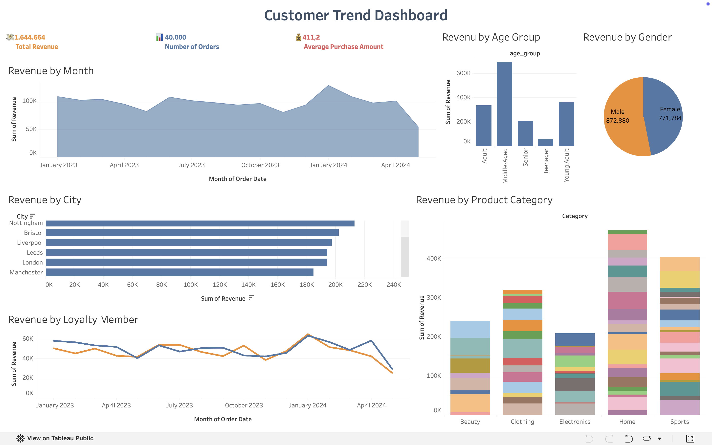

# Customer Trend Analysis

## Project Overview

This project analyzes customer performance data to understand spending patterns, customer segments, product preferences, and loyalty member to guide strategic business decisions.

## Business Objective

The objective is to identify which customer male vs. female, customers age, regions, loyalty members, and product categories contribute the most to revenue, while also documenting data quality issues that should be reviewed before making dashboard-based decisions.

## Dataset

The dataset contains order-level sales records and customers record with fields such as order id, customer id, product id, age, region, loyalty members, signup-date, order-date, quantity, product category, product name, price, and revenue.

The dataset includes intentional data quality issues such as inconsistent text formatting, date formatting differences, duplicate order IDs, and some numeric values stored as text.

## Tools Used
- Kaggle dataset
- MySQL
- Tableau dashboard
- GitHub documentation

 ## Analysis Process

1. Reviewed raw order data and data dictionary.
2. Standardized text fields such as city, and product category.
3. Converted date and numeric fields into analysis-ready values.
4. Reviewed duplicate orders, missing values, and unusual status records.
5. Built summary analysis for revenue, order count, average order value, customer age, product category, and loyalty members.
6. Created a dashboard preview and business insights.

## Key Insights

- Male generated the highest revenue.
- Middle-aged had the strongest revenue.
- Notttingham was the strongest region by revenue.
- Home was the highest category by revenue.
- Loyalty members spending most rather than the non-loyalty members.

## Dashboard Preview

## Files

- `customer-trend-dataset.file`: source dataset used for the project
- `https://www.kaggle.com/datasets/nudratabbas/sql-practice-dataset-1-easy-queriesz`: kaggle dataset source
- `customer—trend-analysis.file`:  dataset with cleaned data
- `dashboard-preview.png`: dashboard preview image 
- `https://public.tableau.com/app/profile/suci.fitria/viz/CustomerTrendDashboard/CustomerTrendDashboard`: dashboard tableau preview 
- `data-cleaning-log.md`: business-style cleaning documentation
- `business-insights.md`: summary of key findings and recommendations
- ’data-cleaning.sql`: documentation data cleaning with MySql
- ’exploratory-data-analysis.sql`: documentation EDA with MySql

## Summary Metrics

| Metric | Value |
|---|---:|
| Revenue | 1.644.664 |
| Orders | 40.000 |
| Average Purchase Amount | 411,2 |
| Loyalty Members | 570 |
